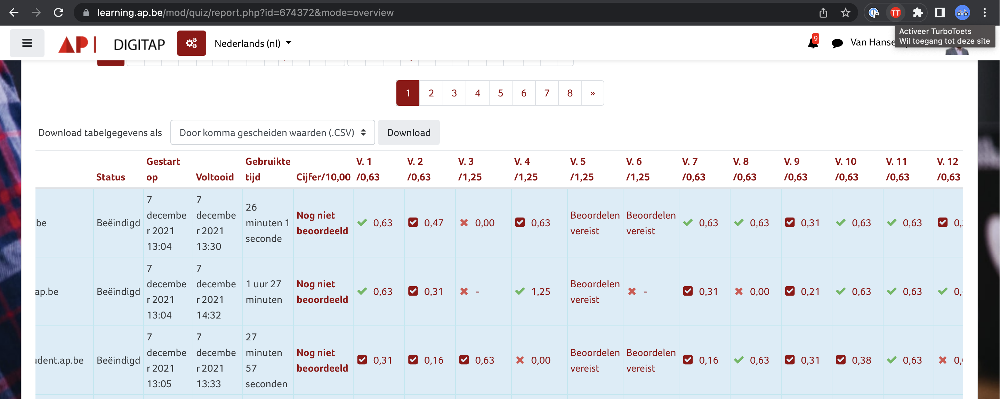
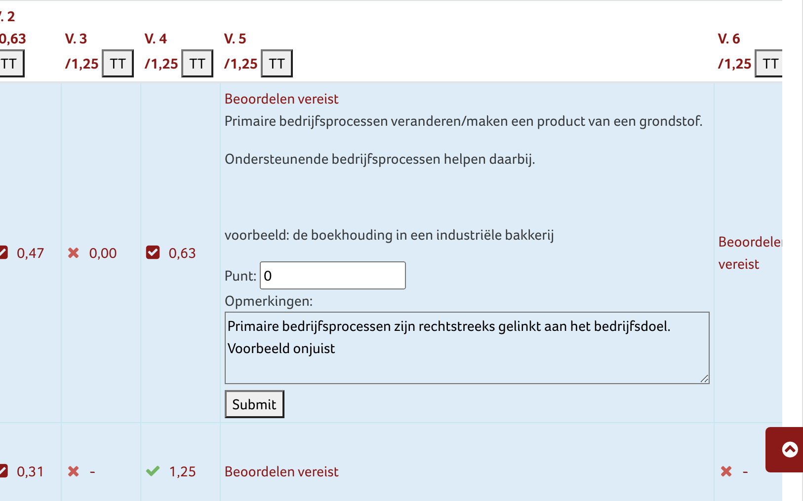

# Gebruik van TurboToets

*Heb je TurboToets nog niet geïnstalleerd, voer dan deze [installatieinstructies](./installatie.md) uit.*

1. Ga naar de **Pogingen** pagina van een Moodle test. Dit kan zowel op de schoolomgeving (bv https://learning.ap.be) als de toetsomgeving (https://toets.ap.be). Scroll naar het vragenoverzicht.

  

2. Vraag 5 is in deze test een open vraag. We klikken eerst op het TurboToets icoon rechts bovenaan. Er verschijnen knoppen `TT` bij de verschillende hoofdingen. Klik op de hoofding bij de vraag die je wil verbeteren. 

We vullen de punten in en een eventuele opmerking. Met de <kbd>TAB</kbd>-toets ga je naar de `Submit`-knop. Toets <kbd>ENTER</kbd>. Het volgende antwoord verschijnt, klaar om te verbeteren.