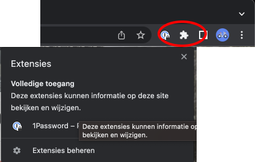
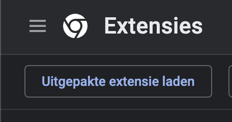
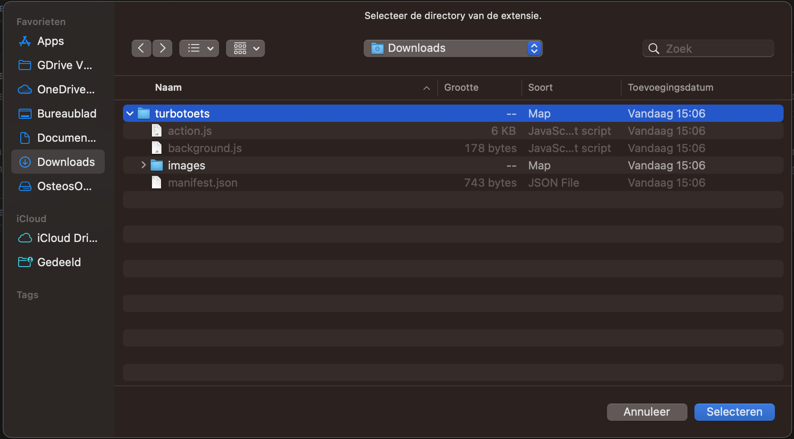
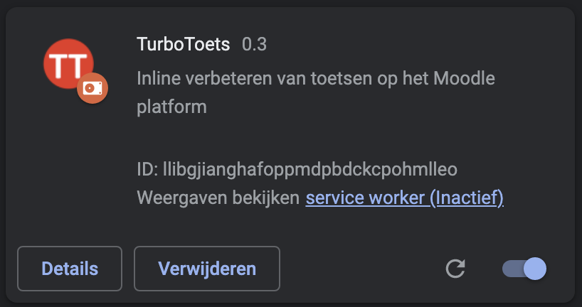
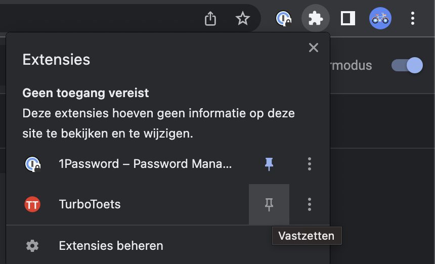

# Installatieprocedure TurboToets

*Opgelet, de extensie is in alpha modus, er wordt enkel ondersteuning geboden in best-effort modus. Dit project is niet gelinkt met de AP Hogeschool en werd ook niet besteld of betaald door haar. Mail of Teams me (Dries Van Hansewijck) voor meer informatie.*

Welkom bij de installatieprocedure voor de TurboToets extensie. De extensie is nog niet gepubliceerd naar de Chrome Web store, dus je moet zelf een aantal manuele stappen uitvoeren.

1. Installeer Chrome of Brave (Edge kan werken, maar heb ik niet getest)

2. Download het [turbotoets.zip](../turbotoets-v0.3.zip) bestand en pak het uit. Onthoud deze locatie. 

3. Ga naar *Extensies beheren*
  

4. Activeer ontwikkelaarsmodus (rechts bovenaan)

  

5. Klik links bovenaan op *Uitgepakte extensie laden*
  

6. Een venster verschijnt. Navigeer naar de locatie waar je het .zip bestand hebt uitgepakt. Selecteer de map waarin de bestanden staan.

  

7. TurboToets werd nu geïnstalleerd als extensie. 
  

8. Zet TurboToets vast. Klik rechts bovenaan op het extensie menu. Klik op de punaise rechts van TurboToets. Het icoontje verschijnt nu rechts bovenaan in de balk.

  